# Actual framebuffer previews

Generated by `python3 tests/ui/render_test.py --preview docs/screens/new` using the production English UI, framebuffer drawing and thicker 8×12 font, not a design mockup. Glyph advance and line layout are unchanged. Individual PNGs are native 200×200, monochrome 1-bit grayscale; view at integer magnification without smoothing. `overview.png` is a nearest-neighbor enlargement of home, notes, settings and SD warning.

Settings order is `Notes, Synchronization, Wi-Fi, Storage, Full refresh, About, Back`. The generated
state previews also cover the generic six-row submenu, Cancel-default SD format warning,
selected Erase SD warning, and the 10-minute Wi-Fi portal: a real Wi-Fi join QR,
complete SSID (`Whistle-xxxxxx`), eight-character password and `192.168.4.1`.
The QR uses the production Nayuki C encoder, black 2×2px modules and a white
four-module quiet zone. It encodes escaped WPA credentials, not the portal address.
Host tests decode the real framebuffer with zxing-cpp, including a 32-byte SSID
containing all Wi-Fi QR delimiters, and verify manual fallback on encoding failure.
The current `portal.png` was visually inspected at its native 200×200 resolution;
it uses synthetic credentials only. Real phone/hardware scanning remains unverified.

| State | Actual render |
| --- | --- |
| Home |  |
| Settings | 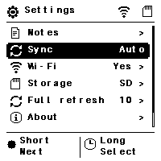 |
| Settings without SD | 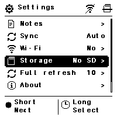 |
| Settings scrolled to Back | 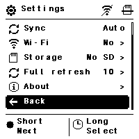 |
| Wi-Fi submenu | 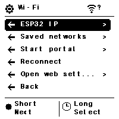 |
| Storage submenu | 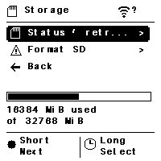 |
| Synchronization submenu | 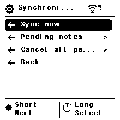 |
| Selective cancellation, Back default | 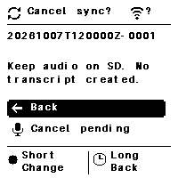 |
| All-pending cancellation, Back default | 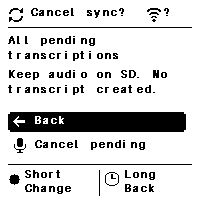 |
| Usage status | 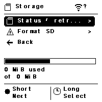 |
| Format, Cancel default | 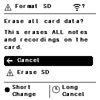 |
| Format, Erase selected | 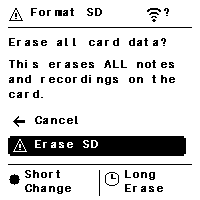 |
| Physical portal instructions | 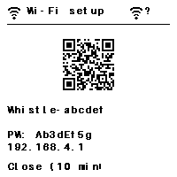 |
| Missing SD, menu still available | 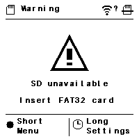 |
| Storage retry information | 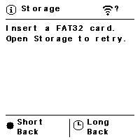 |
| Saved-note browser | 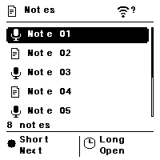 |
| Long note list, first page | 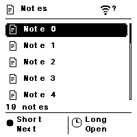 |
| Long note list, final page | 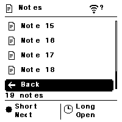 |
| Empty history | 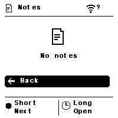 |
| Reader | 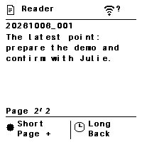 |
| Saved transcript | 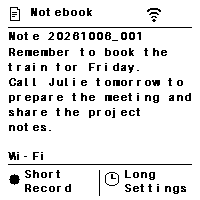 |
| Live recording, connected Wi-Fi | 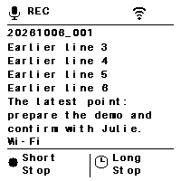 |
| Live recording, offline | 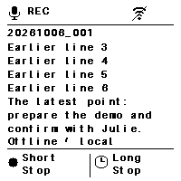 |
| Offline saved note | 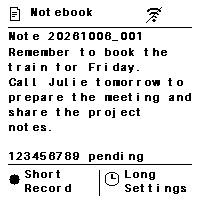 |
| Empty notebook | 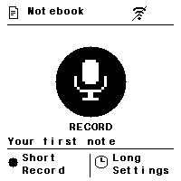 |
| Recording without transcript | 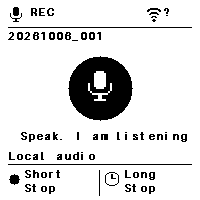 |
| Menu, unknown network | 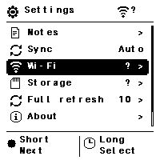 |
| Sync, unknown network | 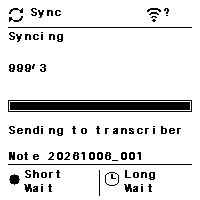 |
| Error, unknown network | 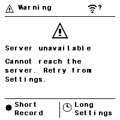 |
| Boot, SD initializing (0/4) | 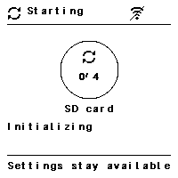 |
| SD ready (1/4) | 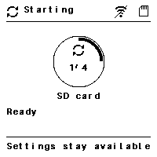 |
| SD unavailable, Settings usable | 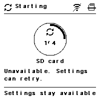 |
| Audio initializing (1/4) | 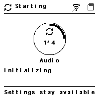 |
| Home Wi-Fi connecting (2/4) | 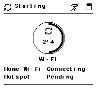 |
| Hotspot fallback connecting (2/4) | 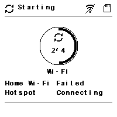 |
| Wi-Fi connected, observed IP | 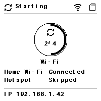 |
| Wi-Fi failed | 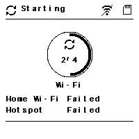 |
| Server checking (3/4) | 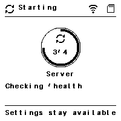 |
| Server ready (4/4) | 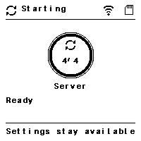 |
| Server unavailable (4/4) | 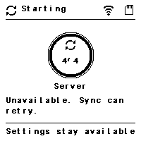 |
| Server skipped, no Wi-Fi (4/4) | 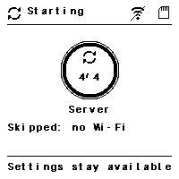 |
| Current sync, Long Cancel | 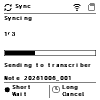 |
| Stopping sync, worker still joining | 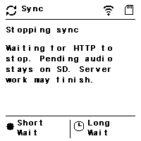 |
| Sync cancelled, pending audio retained | 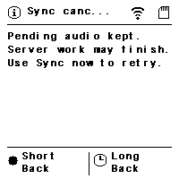 |

Boot uses four completed startup stages (SD, audio, Wi-Fi, server), **not** a time
estimate or successful-step percentage. Failed/skipped stages also complete; no
fake spinner updates the e-paper. The server frame represents an actual bounded
public `/health` check in firmware; these screenshots supply synthetic outcomes.
Ready requires HTTP 200 plus the expected service/status; a lazy unloaded Whistle
model is allowed. No Wi-Fi/configuration skips health and Settings stays available.
Sync cancellation is cooperative: Stopping remains visible until the HTTP worker
joins. A request already accepted by the server may still finish remotely.
`--preview-boot docs/screens/new` regenerates only these owned boot/new-sync PNGs,
leaving unrelated previews and overview untouched.

Live previews deliberately include an overlong transcript: older lines disappear and the latest lines remain readable. Preview transcripts are English fixtures; user transcripts are not translated. `Wi-Fi` means the supplied connection boolean is true, not that the transcription server is healthy. Legacy screens without a network argument show a question mark beside the network icon. Pending counters report the provided queue count, not battery, storage capacity or guaranteed sync success. The empty preview has neither a note ID nor a transcript. The SD warning offers menu/settings rather than requiring a restart; the main loop owns button handling and retry behavior.

`submenu.png` is a synthetic seven-entry scrolling-layout stress fixture, not a
list of implemented storage features. `wifi-menu.png` and `storage-menu.png` use
the real current submenu entries. Portal credentials are synthetic test values;
the device generates a new physical password for each activation.

List scrollbars appear only when entries extend beyond the displayed range. Their
thumb represents the actual first/last entries, including Back and partial final pages,
not an invented page count. Settings retains state values alongside `>` for child views;
Synchronization opens its child view; Back has no chevron. Submenu previews supply explicit child flags: Wi-Fi IP,
saved networks and portal; Storage status/retry information and format confirmation.
Reconnect and Back are actions without chevrons. The generic stress fixture supplies
no child flags and therefore has no chevrons. First/final long-note and scrolled Settings
PNGs were visually inspected after generation; bounds and glyph masks are pixel-tested.

Verification: the host suite passes normally and with Clang ASan/UBSan/float-cast-overflow instrumentation. Tests compare the actual thicker glyph pixels to the unchanged regular bitmap, including inverse foreground, scaling and panel-edge cells. No physical panel validation or controller/power/partial-refresh changes are included.
