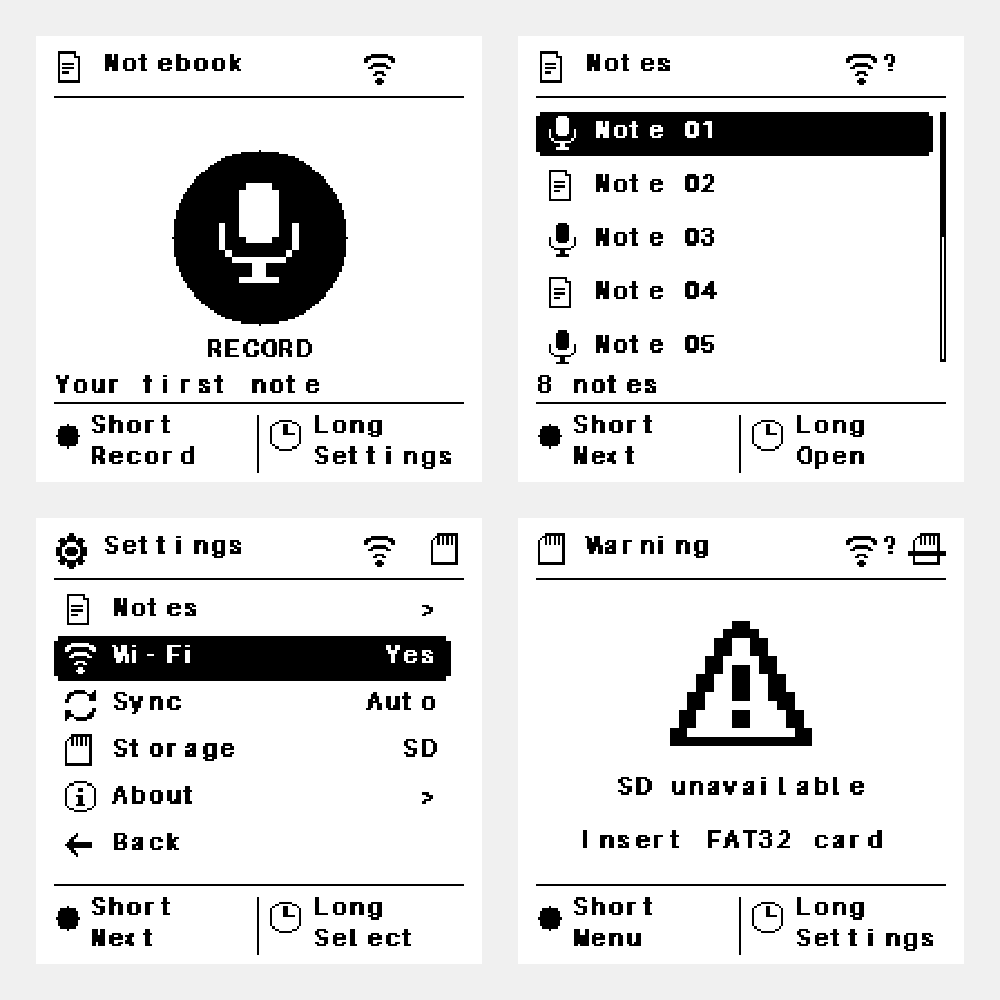

# Current English framebuffer previews

Regenerate with `python3 tests/ui/render_test.py --preview docs/screens/reference-ui` from the repository root. The same current frames are also generated in `docs/screens/new/`.

Individual frames are native 200×200 1-bit grayscale PNGs rendered by the production UI and framebuffer code. The overview enlarges real pixels with nearest-neighbor scaling. Preview transcripts and note IDs are explicit English fixtures, not device recordings.

The font is thicker without changing its 8×12 cell, advance or wrapping. White-on-black selected rows use the same bold foreground mask. Missing SD does not imply a halted UI: `sd-error.png` offers Menu/Settings, `settings-no-sd.png` shows a selectable Storage entry and `No SD`, and `storage-info.png` demonstrates the compatible information/retry screen with Back actions. Firmware main owns button dispatch and actual mount retries.

See `tests/ui/README.md` for RED/GREEN evidence, pixel assertions and sanitizer commands. These previews verify host framebuffer rendering, not controller initialization, power sequencing, SD hardware or physical e-paper performance.
